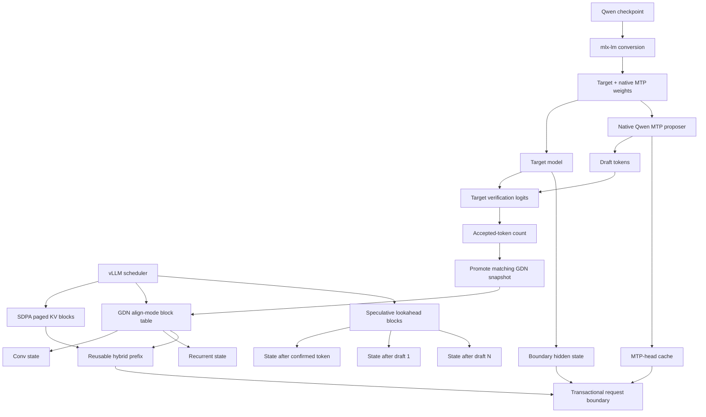

# vLLM Metal #610 — transactional hybrid GDN speculation lab

This directory is a reproducible downstream patch lab for
[`vllm-project/vllm-metal#610`](https://github.com/vllm-project/vllm-metal/issues/610).
It is pinned to `vllm-project/vllm-metal@083f581f048b1b4460f166b31ec18dc6ec000e17`.

The goal is not another inference framework. The goal is to connect the two
state systems that now exist:

1. `mlx-lm` native Qwen MTP loading, verification, rollback, and transactional
   multi-turn prompt-cache boundaries.
2. `vllm-metal` scheduler-owned paged KV and align-mode GDN prefix caching.

## The spider web



## Core invariant

For a speculative verification window containing the always-committed token
plus `K` drafts, the recurrent state needs `K + 1` observable checkpoints:

```text
state slot 0 = after confirmed input token
state slot 1 = after accepted draft 1
...
state slot K = after accepted draft K
```

After target verification emits `num_sampled` output tokens, the correct GDN
checkpoint is universally:

```text
selected_state_index = num_sampled - 1
```

That matches upstream vLLM's Mamba/GDN `num_speculative_blocks` and
`num_accepted_tokens - 1` contract. The Metal implementation must preserve the
same contract while keeping MLX state arrays and scheduler block ownership in
sync.

## Phases

### Phase 1 — scheduler/state-chain contract

- report `num_speculative_blocks` in every hybrid `MambaSpec`;
- reserve the lookahead columns in scheduler block tables;
- build per-request GDN state chains from the current state block through the
  speculative blocks;
- promote the state selected by the verifier without touching unrelated
  striped cache groups;
- keep the existing platform/runtime safety gates in place.

### Phase 2 — state-producing verification

- make the GDN wrapper emit one conv/recurrent checkpoint per verification
  token;
- start with a correctness-first sequential Metal/MLX path;
- retain the existing fused path for ordinary decode and prefill;
- add forced accept/reject and boundary-crossing tests.

### Phase 3 — native Qwen proposer

- refactor the Gemma4-specific proposer interface into a native-MTP protocol;
- adopt `supports_mtp`, `mtp_forward`, and `make_mtp_cache` from the hardened
  `mlx-lm` branch;
- make proposer cache ownership request-local and cancellation-safe;
- restore proposer state only when the target hybrid prefix transaction is
  complete.

### Phase 4 — remove gates and benchmark

Only after the correctness matrix is green:

- remove the config-time hybrid-prefix-cache/speculation rejection;
- remove the runtime hybrid verification rejection;
- run cold, warm exact-prefix, shared-prefix, forced rejection, tool-use, and
  long-context agent-session matrices;
- separately report TTFT, decode throughput, acceptance, and total wall time.

## Falsification matrix

The implementation is not complete unless these cases pass:

- no speculation, cache off/on parity;
- MTP with cache off;
- MTP plus align prefix cache;
- accept all, reject first, reject middle;
- block boundary at `B-1`, `B`, and `B+1`;
- multiple striped GDN groups sharing physical pools;
- concurrent requests with different acceptance lengths;
- cancellation, preemption, eviction, and resume;
- tool-call structured output and multi-turn agent continuation;
- cached continuation equals an uncached full-transcript target run.

## Relationship to the mlx-lm branch

The lower-layer transaction is implemented and fully validated here:

- PR: <https://github.com/PhilipJohnBasile/mlx-lm/pull/3>
- Transaction commit: `ac6aaffd8fdfb8c8e713e17f155d83e3d72b0a0f`
- Full macOS gate: <https://github.com/PhilipJohnBasile/mlx-lm/actions/runs/31923356111>

This lab supplies the scheduler/block half of the same transaction rather than
inventing a parallel serving stack.
